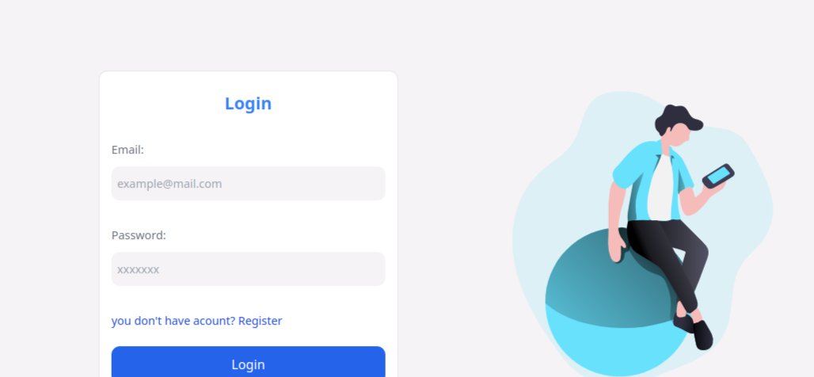
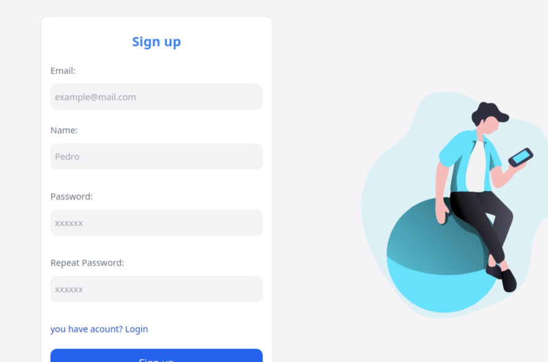

# Fake User

## Detalles de la aplicacion 

Mostrar al usuario una tabla de datos solo para usuarios registrados. La aplicacion cuenta con un login:

Y un un apartado de registro:

## Tiempo estimado

Realizar el challenge me tomo 3 dias, realicé la mayoria de los requerimientos que se solicitaban.

## Funcionalidades añadibled

Si el tiempo hubiera sido mayor a lo acordado, añadiria funcionalidades como:

- *Página de bienvenida al usuario*.
- *Apartado de Logout*.
- *Visualización del perfil de usuaio*.
- *Apartado de editar datos del usuario*.
- *Aregar fotos de los usuarios en las tablas*.
- *Agregar diseño responsivo*.
- *Agregar filtro de orden*.
